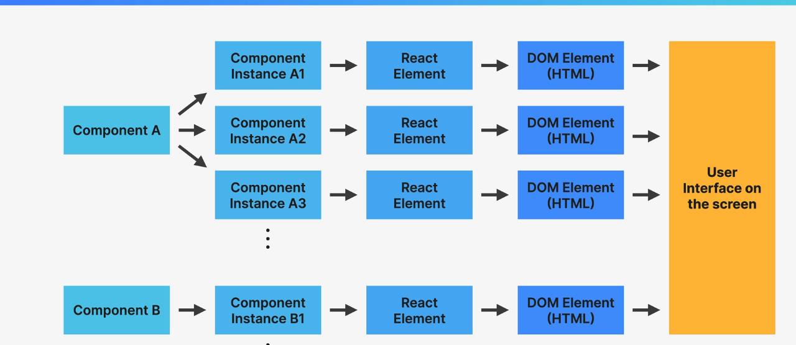

# State

## What is State ?

- Data that a component can hold over time, necessary for information that it needs to remember throughout the app's lifecycle.
- " Components memory"
- Component State: Single local component variable ("Piece of State", "State variable")
- Updating component state triggers React to re-render the component.

## THE "THINKING IN REACT" PROCESS:

### Not a rigid process

#### Break the desired UI into components and establish the component tree

#### Build a static version in React (without state)

### State management

#### Think about state:

- When to use state
- Types of state: local vs. global
- Where to place each piece of state ■

### Establish data flow:

- One-way data flow
- Child-to-parent communication
- Accessing global state

## When YOU KNOW HOW TO "THINK IN REACT" YOU WILL BE ABLE TO ANSWER

### How to break up a UI design into components ?

### How to make some components reusable ?

### How to assemble UI from reusable ?

### What pieces of state do I need for interactivity ?

### What to place state ? (What component should "own" each piece of state ?)

### What types of state can or should I use ?

### How to make data flow through app?

## State management

### ANSWER : Deciding when to create to pieces of state, what types of state are necessary, where to place each piece of state, and how data flows through the app.

## Types of State in React

## Local State vs Global State in React

| **Aspect**         | **Local State**                                                    | **Global State**                                                                                     |
| ------------------ | ------------------------------------------------------------------ | ---------------------------------------------------------------------------------------------------- |
| **Scope**          | Managed within a single component.                                 | Shared across multiple components in the application.                                                |
| **Purpose**        | Handles state specific to a single component’s behavior or UI.     | Manages application-wide data that needs to be accessible across multiple components.                |
| **Examples**       | Toggle a modal, manage form input values, or track a counter.      | User authentication status, theme (light/dark mode), or cart items in an ecommerce application.      |
| **Implementation** | `useState` or `useReducer` within a component.                     | `useContext`, `useReducer` with context, or state management libraries like Redux or Zustand.        |
| **Performance**    | Limited to re-rendering the specific component it belongs to.      | May require efficient management to avoid unnecessary re-renders across components.                  |
| **Complexity**     | Simple to implement and manage.                                    | Can become complex as the app grows, especially when state sharing and updates require coordination. |
| **Best Use Cases** | Component-specific state or when state does not need to be shared. | When multiple components need access to or need to update the same data.                             |

# Component vs Instance vs Element

## Component

- component just piece of user interface.
- Description of UI.
- Just a regular JavaScript function.
- A component is function that returns a react elements (element tree), usually written JSX.
- Component is generic description of UI.
- Blueprint or Template

## Instance

- One blueprint or template

# Thinking in React.

- How to think of Component.
- How to identify states.
- How to Decide on the data flow.

## How to think of Component

### Component and Component Instance

### How components are displayed on the screen

# UseEffect

- UseEffect call after first render current component and when changing the dependency.

# Tailwind CSS

- jsconfig.json
- { "exclude": ["node_modules"] }
